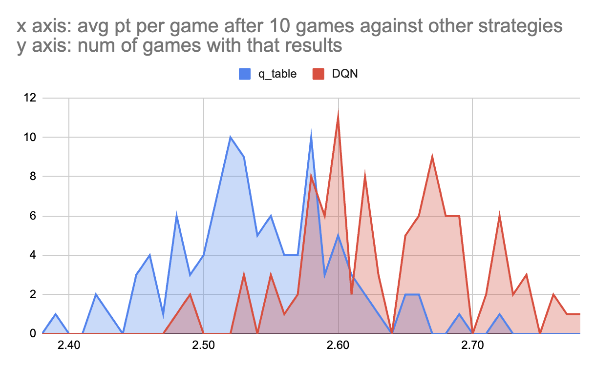

<h3 align="center">
  
</h3>

# Iterative Prisoner's Dilemma in Python

This repository contains a Python implementation of the Iterative Prisoner's Dilemma, featuring over 25 common strategies along with a reinforcement learning (RL) strategy implemented using Deep Q Networks (DQN). This is a "companion" repository to another, almost identical, which [implements the RL agent using a q_table technique](https://github.com/fiore42/Prisoner-Dilemma-q_table-Python).
I was only able to develop the DQN approach after I understood the basic q_table example.

The program is designed to simulate 9 strategies facing each other in the Prisoner's Dilemma, a standard example of a game analyzed in game theory that shows why two completely rational individuals might not cooperate, even if it appears that it is in their best interest to do so.

The image above shows the results of running 100 times the same arena with the same 9 strategies (including rl_strategy) and comparing the results obtain by the q_table approach (in blue) vs the results obtained by the DQN approach (in red). 

The p-value is 1.0006755684628032e-22 (!) so the difference is clearly statistically significant. Keep in mind that with a different set of 9 strategies the two RL might behave differently. You can find all the data and calculation in find_p_value.py

For more details on this project, check [this Medium article](https://fiore42.medium.com/from-zero-to-reinforcement-learning-rl-with-gpt4-2977405a0223)

For now, the Medium article is only focused on the q_table part of the project. After I understood the q_table approach I went back to the DQN code and I managed to fix it.
Interestingly enough, outside of reinforcement_learning.py, the rest of the code in the two repositories is almost identical (which is what you would expect).

## Features

- **Multiple Strategies**: Over 25 predefined strategies to simulate various scenarios in the Prisoner's Dilemma.
- **Reinforcement Learning Strategy**: A strategy built using a DQN approach to reinforcement learning, providing an advanced and adaptive strategy model.
- **Strategy Selection**: By default, the program randomly selects 9 strategies for each run, always including the `rl_strategy`. However, users have the option to specify a custom list of strategies using `-a`.
- **Verbose Output**: Supports `-v` (verbose) and `-vv` (very verbose) flags for additional debugging and operational insights.

## Getting Started

### Prerequisites

Ensure you have Python installed on your machine. This code is compatible with Python 3.x.

### Installation

Clone the repository to your local machine:

```bash
git clone https://github.com/fiore42/Prisoner-Dilemma-DQN-Python.git
cd Prisoner-Dilemma-DQN-Python
```

### Usage

Run the program with the default settings:

```bash
python main.py
```

To select specific strategies, use the `-a` option followed by the strategy names:

```bash
python main.py -a strategy1 strategy2 ... strategyN
```

Use the verbose options for more detailed output:

```bash
# Verbose
python main.py -v

# Very Verbose
python main.py -vv
```

## Contributing

Contributions to the project are welcome! Please feel free to submit a pull request or open an issue for bugs, suggestions, or feature requests.

## License

This project is licensed under the GNU General Public License v3.0 - see the [LICENSE.md](LICENSE.md) file for details.

## Acknowledgments

- Inspired by [this YouTube video](https://www.youtube.com/watch?v=mScpHTIi-kM) on the Prisoner's Dilemma.

